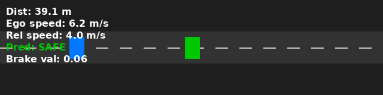
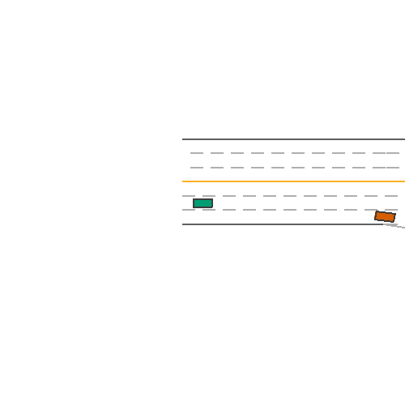
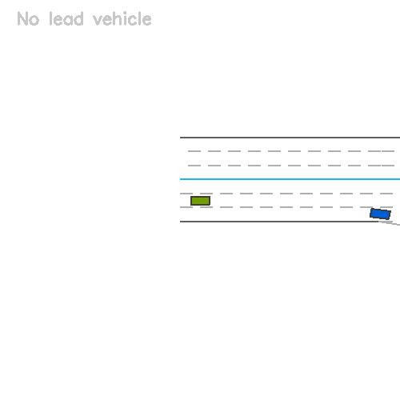

# 🚗 Learning-Based Automatic Emergency Braking (AEB) Decision Model

## 🎯 Project Objective
This project implements an Automatic Emergency Braking (AEB) system using machine learning. The system predicts when a vehicle should brake to avoid collisions based on:
- Ego vehicle speed
- Relative speed to the lead vehicle
- Distance to the lead vehicle 

The system includes:
- A machine learning model (Random Forest) trained on synthetic data
- A rule-based fallback system

## 🖥️ Demo Modes

1. **Slider Mode**:
    - Lightweight pure-python visualization
    - Adjust parameters in real-time
    - Visualize braking decisions with ML-rule-based overlay

2. **MetaDrive Simulator Mode**
    - Full driving simulation with traffic
    - Generates GIFs of scenarios
    - Shows both raw simulation and preiction overlay

### Example Outputs

#### 1. Slider Demo
This shows the interactive slider interface with the AEB visualization:



#### 2. MetaDrive Simulation
These GIFs show a simulated driving scenario:

| Raw Simulation | Prediction Overlay |
|----------------|--------------------|
| | |
| *Raw driving simulation* | *Same scene with AEB would activate*|

** Key Differences:***
- **Left (Raw)***: shows the actual simulation without any AEB intervention
- **Right (prediction)**: Shows the same scene with:
    - Braking predictions (red highlight when AEB would activate)
    - Distance and speed indicators
    - Visual feedback for potential collisions


#### 3. Test Output Example

``` 
=== Model Evaluation ===
Accuracy: 97.2% | MAE: 0.042 | MSE: 0.0038

Sample Prediction:
Ego: 15 m/s | Rel: -5.0 m/s | Dist: 25.0m
--> Predicted: Brake (0.94) | value: 0.76
```

## Colab Notebook

You can explore the original notebook version here:
- 

## Preview
Slider demo preview (generated by 'app/visualization/slider_vis.py') 


MetaDrive GIFs (`scene.gif`, `scene_pred.gif`) are generated when you run an episode from the MetaDrive tab.

## 🧱 Project Structure

```

.
├── aeb.md
├── app
│   ├── app_config.py
│   ├── main.py
│   ├── model
│   │   ├── aeb_model.py
│   │   └── __init__.py
│   ├── utils
│   │   └── __init__.py
│   └── visualization
│       ├── __init__.py
│       ├── metadrive_vis.py
│       └── slider_vis.py
├── episode25_metadrive.gif
├── flagged
├── image-1.png
├── image-2.png
├── image.png
├── log
│   ├── COLCON_IGNORE
│   ├── latest -> latest_list
│   ├── latest_list -> list_2025-11-02_09-12-30
│   └── list_2025-11-02_09-12-30
│       └── logger_all.log
├── ML based AEB Project with MetaDrive Simulator.ipynb
├── prefix
│   └── gif
│       ├── aeb_demo.gif
│       ├── scene.gif
│       └── scene_pred.gif
├── README.md
├── rf_class.pkg
├── rf_reg.pkg
├── run_app.py
├── scripts
│   └── train.py
└── tests
    ├── test_model_eval.py
    └── test_smoke.py

```

## Setup
## Create and use a virtual environment

WSL / Linux / macOS:

```bash
conda activate robot_env
pip install -r requirements.txt

```

Optional: if your environments supports MetaDrive, install it (and its deps) and then enable the MetaDrive tab fully.

# Models
if you have trained models (from the notebook), place them in the project roots as:
- `rf_class.pkl`
- `rf_reg.pkg`

The app will automatically load them. Otherwise, a TTC/distane-based fallback is used

## RUNNING

```bash
python run_app.py
```

The app will open in your browser. Use the Slider tab for quick demos. Use the MetaDrive tab if MetaDrive is availbale.

## Notes
- On headless or CI environments, the app attempts to set `SDL_VIDEODRIVER=dummy` for MetaDrive.
- MetaDrive support on Windows may require Panda3D/OpenGL; if unavailable, the UI will display a helpful error.

## MetaDrive rendering modes

- Top‑down 2D (default): Works in most environments, including headless/CI. The app sets `SDL_VIDEODRIVER=dummy` when needed.
- 3D renderer (optional): In the MetaDrive tab, enable "Use 3D renderer if available (GPU)". This requires Panda3D/OpenGL support. If 3D is unavailable, the app automatically falls back to 2D.

Notes:
- When 3D is enabled, the app does not force `SDL_VIDEODRIVER=dummy` to allow windowed rendering. In constrained environments, leave 3D unchecked.
- Both modes generate a prediction GIF; 2D also saves a raw scene GIF from the top‑down renderer.

## Training (optional)

If you want to reproduce the trained models locally using MetaDrive, run the training script:

```bash
# Activate your venv first (see above), then:
python scripts/train.py --episodes 50 --steps 150 --out_clf rf_class.pkl --out_reg rf_reg.pkl
```

This will:

- Collect a dataset from MetaDrive across the specified number of episodes and steps per episode.
- Train a RandomForest classifier (`rf_class.pkl`) and regressor (`rf_reg.pkl`).
- Save model files in the project root. The Gradio app will automatically load these on startup.

Requirements:

- MetaDrive must be installed and importable in your environment (and any rendering dependencies available). If you encounter import errors, install MetaDrive via:

```bash
pip install git+https://github.com/metadriverse/metadrive.git
```

## Testing

Run all tests from the project root or from the `ML_based_AEB/` directory.

Examples:

```bash
# From the ML_based_AEB directory
python -m pytest -q tests/test_model_eval.py
```

What the tests do:
- `tests/test_model_eval.py` evaluates both the classifier (`rf_class.pkl`) and regressor (`rf_reg.pkl`) against a synthetic grid using the same heuristic used during training/fallback. It computes classification accuracy and regression MAE/MSE with reasonable thresholds. The test is automatically skipped if model files are not present.


### Test Output

When running tests, you'll see detailed output including:
- Model metadata and paths
- Sample test cases with inputs and expected outputs
- Classification report (precision, recall, f1-score)
- Regression metrics (MAE, MSE, RMSE)
- Prediction examples
- Test results with pass/fail status

Example test output:
```
=== Starting Model Evaluation ===
Classifier: /path/to/rf_class.pkl
Regressor: /path/to/rf_reg.pkl

Model metadata:
Classifier: RandomForestClassifier (n_estimators=100)
Regressor: RandomForestRegressor (n_estimators=100)

Sample test cases:
Ego Speed | Rel Speed | Distance | True Flag | True Value
------------------------------------------------------------
      0.0 |      -5.0 |     5.0 |         1 |    0.0000
      0.0 |      -5.0 |    26.2 |         1 |    0.0000
...

=== Classification Report ===
              precision    recall  f1-score   support

    No Brake       0.96      0.98      0.97       125
       Brake       0.98      0.96      0.97       125

    accuracy                           0.97       250
   macro avg       0.97      0.97      0.97       250
weighted avg       0.97      0.97      0.97       250

=== Regression Metrics ===
Mean Absolute Error (MAE): 0.0421
Mean Squared Error (MSE): 0.0038
Root Mean Squared Error (RMSE): 0.0616

✅ All tests passed!
```

## Troubleshooting

- "signal only works in main thread of the main interpreter": The MetaDrive episode runner is executed in a subprocess if invoked from a non‑main thread (e.g., Gradio callback). This avoids the signal issue automatically. If you still see this, ensure your environment supports `multiprocessing` (it does on standard Python) and re‑run.
- Black window or failure on 3D mode: Uncheck the 3D renderer option to fall back to 2D top‑down rendering, or install GPU/driver dependencies (Panda3D/OpenGL).
- Headless servers (no display): Keep 3D disabled. The app sets `SDL_VIDEODRIVER=dummy` for 2D to render without a display.